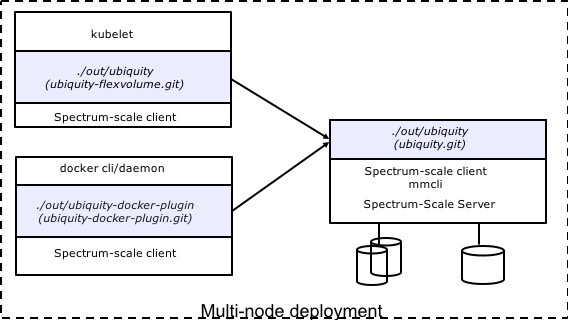

#Ubiquity Storage service for Container Ecosystems
Ubiquity provides access to persistent storage for Docker containers
### Supported Deployment Options
#### Single node (all in one)

#### Multi-node

#### Prerequisites
  * Provision a system running GPFS client and NSD server
  * Install [golang](https://golang.org/)
  * Install git

#### Getting started
- Configure go
GOPATH environment variable needs to be corrected set before starting the build process. Create a new directory and add it to GOPATH 
```bash
mkdir -p $GOPATH/workspace
export GOPATH=$HOME/workspace
```
- Configure ssh-keys for github.ibm.com
go tools require password less ssh access to github. If you have not already setup ssh keys for your github.ibm profile, please follow steps in 
(https://help.github.com/enterprise/2.7/user/articles/generating-an-ssh-key/) before proceeding further. 
- Build Ubiquity service from source (can take several minutes based on connectivity)
```bash
cd $GOPATH/workspace
go get github.ibm.com/almaden-containers/ubiquity.git
cd github.ibm.com/almaden-containers/ubiquity.git
go build -o bin/ubiquity main.go

```
- Run Ubiquity service
```bash

./out/ubiquity -listenPort <> -logPath <> -spectrumConfigPath <> -spectrumDefaultFilesystem <>
```
#### Next steps
- Install appropriate plugin ([docker](https://github.ibm.com/almaden-containers/ubiquity-docker-plugin), [kubernetes](https://github.ibm.com/almaden-containers/ubiquity-flexvolume))
